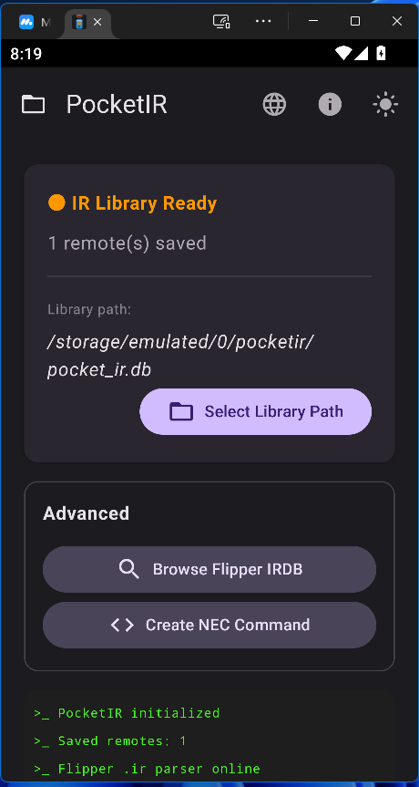
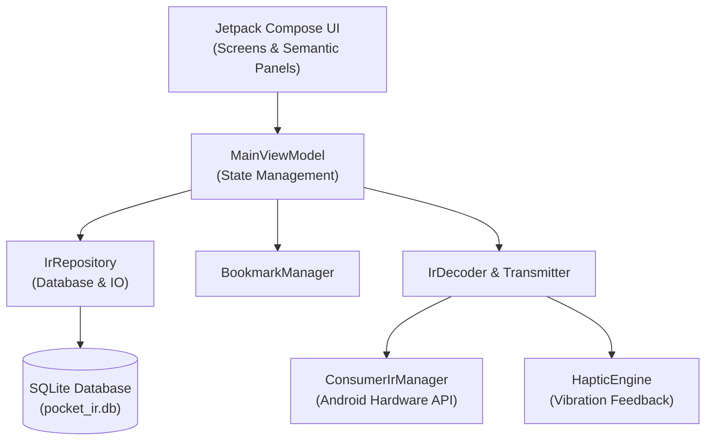
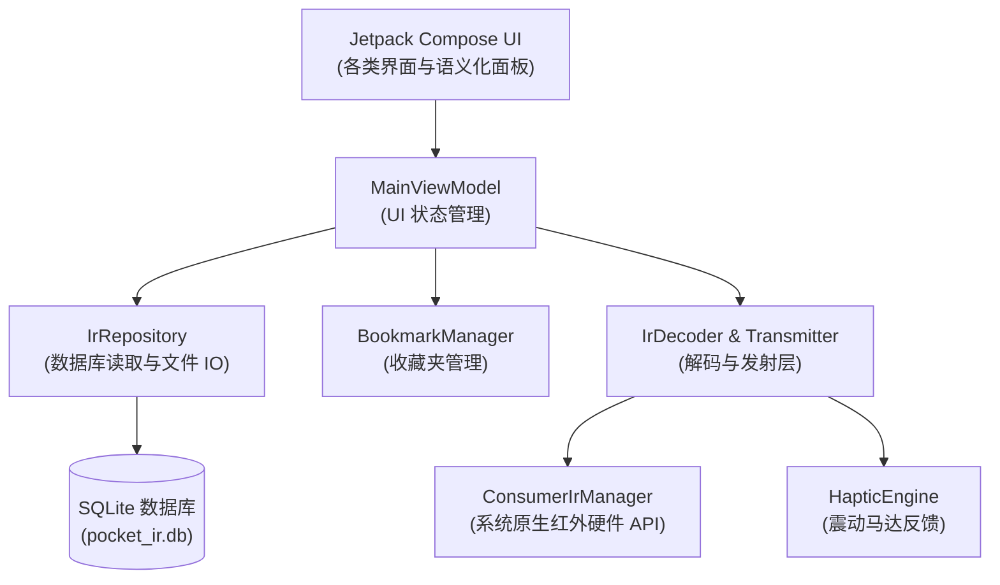

# <p align="center">📡 PocketIR (口袋红外)</p>

<p align="center">
  
</p>

<p align="center">
  <a href="https://opensource.org/licenses/MIT"></a>
  <a href="https://developer.android.com"></a>
</p>

<p align="center">
  <b>A hardcore, pocket-sized infrared remote for Android geeks.</b><br>
  <i>专为极客打造的全能便携红外遥控器。</i>
</p>

<p align="center">
  
</p>

---

# English

**PocketIR** is a highly customizable, lightweight infrared (IR) remote control application designed for Android enthusiasts and Flipper Zero users. Instead of relying on bloated cloud databases, it bridges the massive open-source Flipper Zero IR ecosystem directly to your Android device with zero network permissions.

## ✨ Key Features

- 🛠 **Native Multi-Protocol Decoding**
  Decodes raw Flipper IR payloads (e.g., NEC, NECEXT) locally. It even includes specialized handling for the notoriously strict Sony SIRC protocol (enforcing the 3-frame transmission rule).
- 🔄 **Flipper Zero Ecosystem Bridge**
  Seamlessly reads `.ir` files and pre-baked `.db` databases originating from the Flipper Zero community. 
- 🧠 **Semantic UI Generator**
  The dynamic layout engine parses raw button commands (e.g., "Vol+", "Power", "Up") and automatically maps them into an intuitive, skeuomorphic remote control interface complete with D-Pads and rocker buttons.
- ⚡ **Solidified SQLite Database**
  Includes a custom Python script (`build_ir_database.py`) to pack thousands of text-based `.ir` files into a single, high-performance SQLite database (`pocket_ir.db`), dramatically reducing Android file I/O bottlenecks.
- 🛡️ **Zero Privacy Leaks**
  No network permissions requested. Everything runs 100% locally on your device.

## 🏗 Architecture

PocketIR follows modern Android architecture (MVVM) and is built entirely with Jetpack Compose.



## 🚀 Getting Started

### Build & Run
Ensure the Android SDK is installed, then run the following in the project root:
```bash
./gradlew assembleRelease
```
*Note: A generic `release.jks` has been provided for ease of compilation.*

### ⚠️ Important: Database Preparation
**Please note: To keep the APK lightweight, PocketIR does not bundle the infrared database (`.db` file) inside the installation package.** 

You can either **download the default `pocket_ir.db` from our GitHub Releases page**, or generate your own custom database using the provided script:

1. Clone or download a Flipper IR database (e.g., [Lucaslhm/Flipper-IRDB](https://github.com/Lucaslhm/Flipper-IRDB)).
2. Place `build_ir_database.py` in the root of the downloaded IR database directory.
3. Run `python build_ir_database.py` in your terminal.
4. A `pocket_ir.db` file will be generated. Copy this file to your Android device's external storage.
5. Open PocketIR, grant file access permissions, and select the `pocket_ir.db` file from your local storage to load your library.

---

## 📜 Acknowledgements & Licenses

- **PocketIR** source code is licensed under the **MIT License**.
- **Infrared Database (IRDB)**: The bundled `pocket_ir.db` and the `.ir` formats it relies upon are derived from the [Lucaslhm/Flipper-IRDB](https://github.com/Lucaslhm/Flipper-IRDB) community project, which operates under the **CC0-1.0 (Creative Commons Zero v1.0 Universal)** license. We extend our deepest gratitude to the contributors of that repository.

---

# 中文

**PocketIR（口袋红外）** 是一款专为极客和 Flipper Zero 玩家打造的高自由度、轻量级红外遥控 App。它不依赖任何臃肿的第三方云端库，而是直接将 Flipper Zero 庞大的开源红外码库生态无缝桥接到你的 Android 设备上，且全程零网络权限。

## ✨ 核心特性

- 🛠 **原生多协议硬解码**
  在本地直接对 Flipper 格式的原始红外码进行脉冲解码（如 NEC, NECEXT），并对严苛的 Sony SIRC 协议（必须连发三帧）做了专门的底层适配。
- 🔄 **无缝桥接 Flipper 生态**
  原生支持读取 Flipper Zero 社区的 `.ir` 文件以及预处理好的 SQLite `.db` 数据库。
- 🧠 **语义化 UI 生成器 (Semantic UI Generator)**
  强大的动态布局引擎，能根据干瘪的指令名称（如 "Vol+", "Power", "OK"）自动将其映射组合成带有十字方向键、音量摇杆、独立电源键的拟物化遥控器界面。
- ⚡ **数据库“固实化”方案**
  自带专用的 Python 打包脚本 (`build_ir_database.py`)，可将上万个零散的 `.ir` 文本瞬间“固实化”为一个单体 SQLite 数据库 (`pocket_ir.db`)，彻底解决 Android 的 I/O 性能瓶颈。并在内部启用了 SQLite 显式事务，将建库性能压榨到极致。
- 🛡️ **绝对的隐私安全**
  App 没有申请任何网络权限（无 `INTERNET`），所有交互 100% 在本地完成。

## 🏗 架构设计

PocketIR 遵循现代 Android 开发架构 (MVVM)，且完全使用 Jetpack Compose 构建。



## 🚀 快速开始

### 编译运行
确保你已安装 Android SDK，然后在项目根目录执行：
```bash
./gradlew assembleRelease
```
*注：项目已内置了一个默认的 `release.jks` 签名文件以便快速构建。*

### ⚠️ 重要提示：导入红外库
**请注意：为了保持安装包的绝对轻量，PocketIR 的 APK 安装包内不包含任何红外码库（.db 文件）。**

你可以直接在 **GitHub Releases 页面下载我们提供的默认 `pocket_ir.db` 文件**，或者按照以下步骤，使用自带脚本将你喜欢的红外库打包生成：

1. 下载或克隆任意开源的 Flipper 红外库（推荐 [Lucaslhm/Flipper-IRDB](https://github.com/Lucaslhm/Flipper-IRDB)）。
2. 将项目中的 `build_ir_database.py` 脚本复制到你下载的红外库根目录。
3. 在终端运行 `python build_ir_database.py`。
4. 脚本会生成一个 `pocket_ir.db` 文件。将这个文件传输到你手机的存储卡（外部存储）中。
5. 打开 PocketIR，授予所有文件访问权限，然后在 App 内选择这个 `pocket_ir.db` 即可瞬间完成上万条码库的加载。

---

## 📜 鸣谢与开源协议

- **PocketIR** 本身的代码采用 **MIT License** 协议开源。
- **红外码库 (IRDB)**：项目内置的 `pocket_ir.db` 及关联的 `.ir` 解析结构，来源于开源社区项目 [Lucaslhm/Flipper-IRDB](https://github.com/Lucaslhm/Flipper-IRDB)。该码库在 **CC0-1.0 (Creative Commons Zero v1.0 Universal)** 协议下运作。我们向该仓库的所有贡献者致以诚挚的感谢！